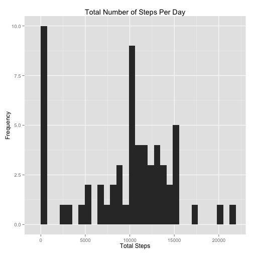
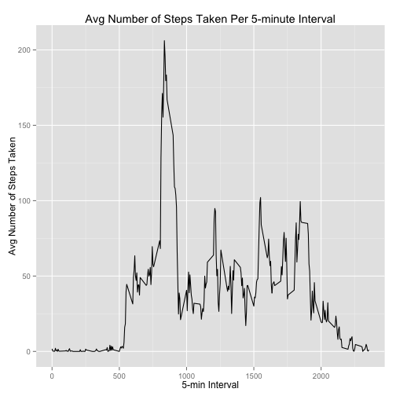
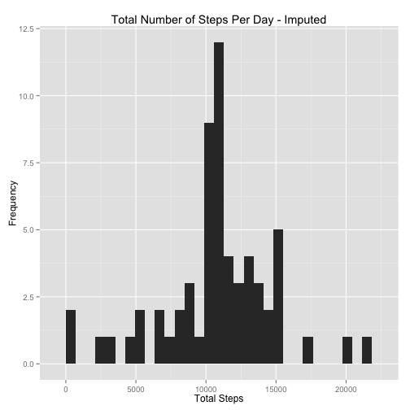
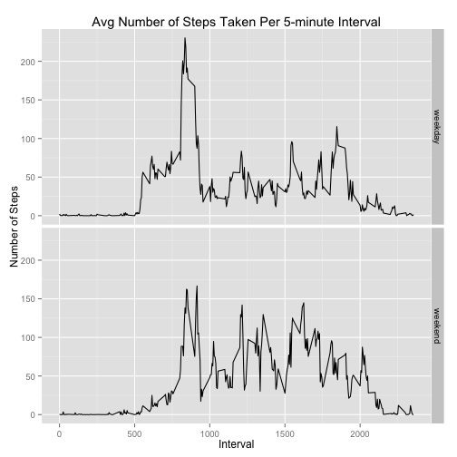

## Loading and preprocessing the data

```r
library(dplyr)
library(ggplot2)

# Check if file exists and is uncompressed
if (file.exists("activity.zip") && !file.exists("activity.csv")) {
  unzip("activity.zip")
}

# Load raw data into data frame
activity <- read.csv("activity.csv")
```

## What is mean total number of steps taken per day?


```r
# Group by date and sum up steps ignoring missing values
stepsummary <- activity %>%
  group_by(date) %>%
  summarise(totalsteps=sum(steps, na.rm = T))

# Plot histogram
ggplot(stepsummary, aes(x=totalsteps)) + 
  geom_histogram() +
  xlab("Total Steps") + 
  ylab("Frequency") +
  ggtitle("Total Number of Steps Per Day")
```

```
## stat_bin: binwidth defaulted to range/30. Use 'binwidth = x' to adjust this.
```

 
  
Mean number of steps per day: 9354.2295082  
Median number of steps per day: 10395  

## What is the average daily activity pattern?


```r
# Group by date and sum up steps ignoring missing values
intervalavg <- activity %>%
  group_by(interval) %>%
  summarise(avgsteps=mean(steps, na.rm = T))

# Plot time series of steps per five-minute intervals
ggplot(intervalavg, aes(x=interval, y=avgsteps)) + 
  geom_line() +
  xlab("5-min Interval") + 
  ylab("Avg Number of Steps Taken") +
  ggtitle("Avg Number of Steps Taken Per 5-minute Interval")
```

 
  
The 5-minute interval, on average across all the days in the dataset, that contained the maximum number of steps was: 835.  

## Imputing missing values

There are 2304 of missing values in the dataset.  
  
Using the mean of the corresponding 5-minute interval to impute missing values, we construct a new dataset.


```r
# Impute NAs in the original dataset using the 5-min interval average
imputed <- activity %>%
  left_join(intervalavg, by="interval") %>%
  mutate(steps=ifelse(is.na(steps), avgsteps, steps)) %>%
  select(steps, date, interval)

# Calculate the total num of steps per date
impstepsummary <- imputed %>%
  group_by(date) %>%
  summarise(totalsteps=sum(steps))

# Plot histogram using imputed values
ggplot(impstepsummary, aes(x=totalsteps)) + 
  geom_histogram() +
  xlab("Total Steps") + 
  ylab("Frequency") +
  ggtitle("Total Number of Steps Per Day - Imputed")
```

```
## stat_bin: binwidth defaulted to range/30. Use 'binwidth = x' to adjust this.
```

 
  
Mean number of steps per day: 10766.19  
Median number of steps per day: 10766.19  

These values are different from the original dataset. Imputing the values has caused the mean and median to increase compared to the original dataset. This is because there are a lot more periods with non-zero days as a result which can be seen by the drop in the 0 bucket of the histogram.  

## Are there differences in activity patterns between weekdays and weekends?


```r
# Label each entry with either weekday or weekend
weekactivity <- imputed %>%
  mutate(dayofweek=weekdays(as.Date(date, "%Y-%m-%d"))) %>%
  mutate(daygroup=ifelse(dayofweek=="Saturday"|dayofweek=="Sunday", "weekend", "weekday")) %>%
  group_by(daygroup, interval) %>%
  summarise(avgsteps=mean(steps))

# Create a faceted plot of weekday vs weekend average steps per 5 min interval
ggplot(weekactivity, aes(x=interval, y=avgsteps)) + 
  geom_line() + 
  facet_grid(daygroup ~ .) + 
  xlab("Interval") + 
  ylab("Number of Steps") +
  ggtitle("Avg Number of Steps Taken Per 5-minute Interval")
```

 
